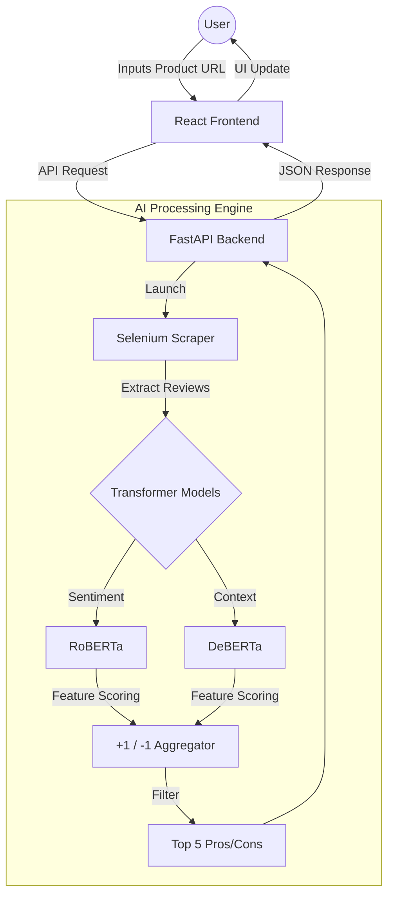

# Shopinion AI 

[](https://reactjs.org/)
[](https://fastapi.tiangolo.com/)
[](https://www.selenium.dev/)
[](https://huggingface.co/)

**Shopinion AI** is an intelligent e-commerce assistant that uses Aspect-Based Sentiment Analysis (ABSA) to summarize thousands of product reviews into a concise list of the **Top 5 Pros and Cons**. Instead of scrolling through endless pages of comments, Shopinion provides a data-driven snapshot of product quality.

---

##  System Architecture & Workflow

The project consists of a modern React frontend and a powerful Python-based processing engine.


## Key Features

###  URL-to-Insight
Paste an e-commerce product URL to trigger deep sentiment analysis across user reviews.

###  Dual Transformer Pipeline
- **RoBERTa** – High-accuracy sentiment classification (Positive / Negative / Neutral)
- **DeBERTa** – Superior understanding of complex context and sentence structure

###  Aspect-Based Sentiment Analysis (ABSA)
Identifies sentiment for specific product aspects such as:
- Battery Life
- Screen Quality
- Build Quality

### Intelligent Scoring Logic
- Positive mention → **+1**
- Negative mention → **-1**

Scores are aggregated across hundreds of reviews to surface top **strengths and weaknesses**.

###  Dynamic Web Scraping
Uses **Selenium** to handle dynamic content and fetch the latest reviews in real time.

---

##  Tech Stack

### Frontend
- **Framework:** React.js  
- **Styling:** Tailwind CSS  
- **Icons:** Lucide React  
- **HTTP Client:** Axios  

### Backend (Shopinion-AI-Backend)
- **Language:** Python 3.9+  
- **Framework:** FastAPI  
- **Scraping:** Selenium WebDriver  
- **AI Models:** Hugging Face Transformers(roberta/deberta)

---

##  Installation & Local Setup

### 1️ Setup Backend
The backend acts as the AI engine.

**Backend Repository:**  
https://github.com/Navin-Jamule/shopinion-ai-backend

```bash
git clone https://github.com/Navin-Jamule/shopinion-ai-backend.git
cd shopinion-ai-backend
pip install -r requirements.txt
uvicorn main:app --reload
```
### 2️ Setup Frontend

```bash
git clone https://github.com/Navin-Jamule/shopinion-ai.git
cd shopinion-ai
npm install
```
##  Example Scoring Logic

**User Review:**
> "The screen is amazing but the battery life is terrible."

| Feature       | Sentiment | Score |
|--------------|----------|-------|
| Screen       | Positive | +1    |
| Battery Life | Negative | -1    |

##  Repository Links

- **Frontend Repository:** https://github.com/Navin-Jamule/shopinion-ai
- **Backend Repository:** https://github.com/Navin-Jamule/shopinion-ai-backend


