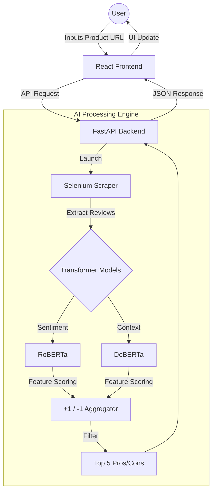

# 🛒 Shopinion AI 

**Shopinion AI** is an intelligent e-commerce assistant that uses Aspect-Based Sentiment Analysis (ABSA) to summarize thousands of product reviews into a concise list of the **Top 5 Pros and Cons**. Instead of scrolling through endless pages of comments, Shopinion provides a data-driven snapshot of product quality.

---

## 🏗️ System Architecture & Workflow

The project consists of a modern React frontend and a powerful Python-based processing engine.

🔥 Key Features
URL-to-Insight: Simply paste an e-commerce link to trigger a deep analysis of user sentiment.

Dual Transformer Pipeline:

    RoBERTa: Optimized for high-accuracy sentiment detection (Positive/Negative/Neutral).

    DeBERTa: Utilized for its superior understanding of complex sentence structures and context.

Aspect-Based Sentiment Analysis (ABSA): The system doesn't just look at stars; it identifies specific features (e.g., "Battery Life", "Screen Quality", "Build").

Intelligent Scoring Logic:

    Positive mention of a feature = +1

    Negative mention of a feature = -1

    The system aggregates these scores across hundreds of reviews to find the most mentioned strengths and weaknesses.

Dynamic Scraping: Uses Selenium to handle dynamic web content and extract the latest reviews.

🛠️ Tech Stack
Frontend (This Repository)
    Framework: React.js

    Styling: Tailwind CSS

    Icons: Lucide React

    HTTP Client: Axios

Backend (Shopinion-AI-Backend)
    Language: Python 3.9+

    Framework: FastAPI

    Scraping: Selenium WebDriver

    AI Models: Hugging Face Transformers (cardiffnlp/twitter-roberta-base-sentiment, microsoft/deberta-v3-base)

🚀 Installation & Local Setup
1. Setup the Backend
    The backend serves as the AI engine. Backend Repo: https://github.com/Navin-Jamule/shopinion-ai-backend
   # Clone the backend repository
    git clone [https://github.com/Navin-Jamule/shopinion-ai-backend.git](https://github.com/Navin-Jamule/shopinion-ai-backend.git)
    cd shopinion-ai-backend
    
    # Install required Python packages
    pip install -r requirements.txt
    
    # Start the FastAPI server
    uvicorn main:app --reload

2. Setup the Frontend (This Repo)

    # Clone this repository
    git clone [https://github.com/Navin-Jamule/shopinion-ai.git](https://github.com/Navin-Jamule/shopinion-ai.git)
    cd shopinion-ai
    
    # Install dependencies
    npm install
    
    # Create a .env file and point it to your backend
    echo "VITE_API_URL=http://localhost:8000" > .env
    
    # Start the development server
    npm run dev

📊 Example Logic
    If a user submits a review: "The screen is amazing but the battery life is terrible."
    Feature    Sentiment Score
    Screen     Positive   +1
    Battery    Negative  -1
    Life 

🔗 Links
    Frontend Repository: [shopinion-ai](https://github.com/Navin-Jamule/shopinion-ai)

    Backend Repository: [shopinion-ai-backend](https://github.com/Navin-Jamule/shopinion-ai-backend)

Developed by Navin Jamule 
