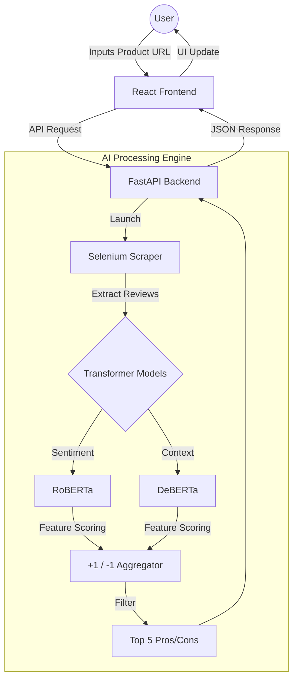

# 🛒 Shopinion AI 

**Shopinion AI** is an intelligent e-commerce assistant that uses Aspect-Based Sentiment Analysis (ABSA) to summarize thousands of product reviews into a concise list of the **Top 5 Pros and Cons**. Instead of scrolling through endless pages of comments, Shopinion provides a data-driven snapshot of product quality.

---

## 🏗️ System Architecture & Workflow

The project consists of a modern React frontend and a powerful Python-based processing engine.

🔥 Key FeaturesURL-to-Insight: Simply paste an e-commerce link to trigger a deep analysis of user sentiment.Dual Transformer Pipeline:RoBERTa: Optimized for high-accuracy sentiment detection.DeBERTa: Utilized for superior understanding of complex context and aspect extraction.Aspect-Based Sentiment Analysis (ABSA): Identifies specific features like "Battery Life" or "Screen Quality" rather than just overall ratings.Intelligent Scoring Logic:Positive mention = +1Negative mention = -1Features are ranked by their cumulative score to find the most significant strengths and weaknesses.Dynamic Scraping: Uses Selenium to handle dynamic web content and extract reviews reliably.🛠️ Tech StackFrontend (This Repository)Framework: React.jsStyling: Tailwind CSSIcons: Lucide ReactHTTP Client: AxiosBackend (Shopinion-AI-Backend)Language: Python 3.9+Framework: FastAPIScraping: Selenium WebDriverAI Models: Hugging Face Transformers (roberta-base-sentiment, deberta-v3-base)🚀 Installation & Local Setup1. Setup the BackendThe backend serves as the AI engine.Backend Repo: Shopinion AI BackendBash# Clone the backend repository
git clone https://github.com/Navin-Jamule/shopinion-ai-backend.git
cd shopinion-ai-backend

# Install required Python packages
pip install -r requirements.txt

# Start the FastAPI server
uvicorn main:app --reload
2. Setup the Frontend (This Repo)Bash# Clone this repository
git clone https://github.com/Navin-Jamule/shopinion-ai.git
cd shopinion-ai

# Install dependencies
npm install

# Create a .env file and point it to your backend
echo "VITE_API_URL=http://localhost:8000" > .env

# Start the development server
npm run dev
📊 Example LogicIf a user submits a review: "The screen is amazing but the battery life is terrible."FeatureSentimentScoreScreenPositive+1Battery LifeNegative-1After analyzing all reviews, the system ranks the features and returns the Top 5 in each category to the React UI.🔗 LinksFrontend Repository: shopinion-aiBackend Repository: shopinion-ai-backendDeveloped by Navin Jamule 🚀 
